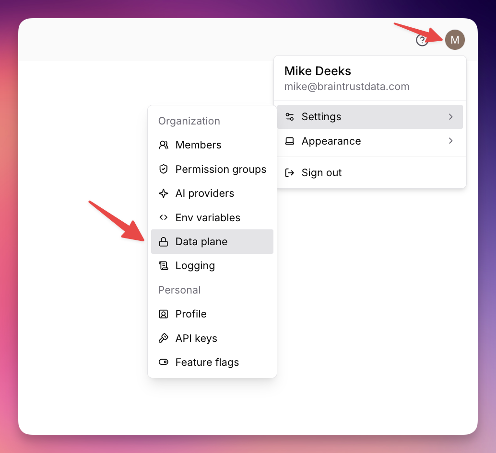
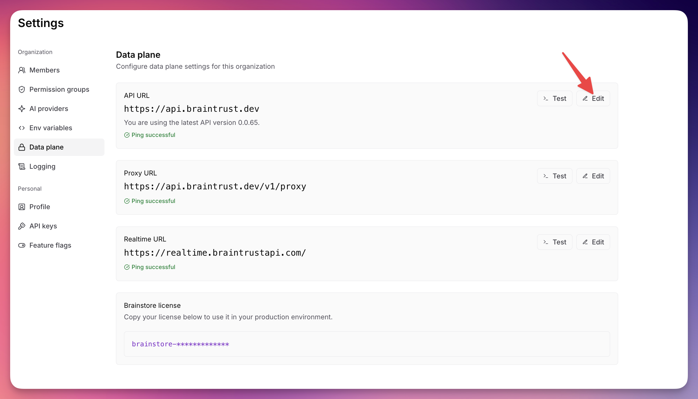
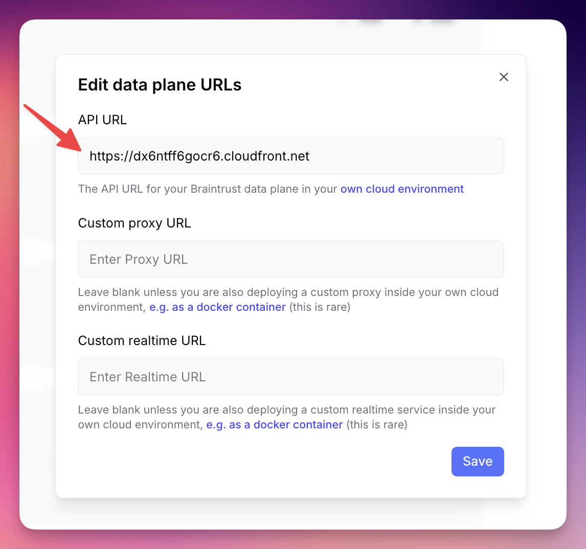
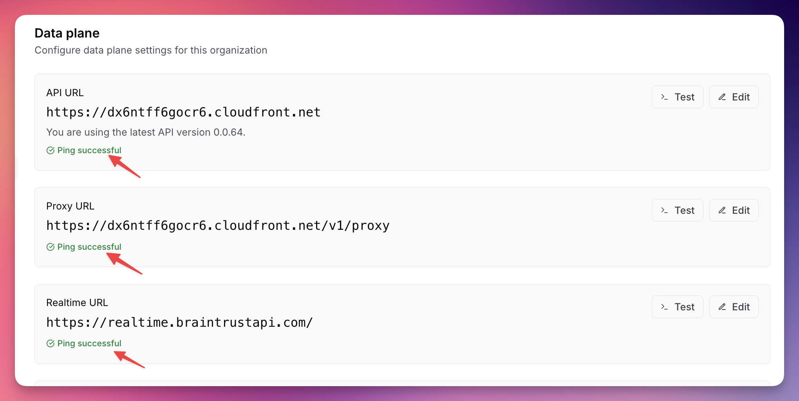

# This is an example of a standard **production-sized** Braintrust data plane deployment. Copy this directory to a new directory in your own repository and modify the files to match your environment.

## Configure Terraform

* `provider.tf` should be modified to use your Google project and region.
* `backend.tf` should be modified to use the remote backend that your company uses. Typically this is a GCP bucket.
* `main.tf` should be modified to meet your needs for the Braintrust deployment. The defaults are sensible only for a production deployment.

## Prerequisites

### Enabling APIs

With GCP, their services or APIs are disabled by default in a project. When trying to deploy the necessary resources for the Braintrust Module, if the necessary Services are not enabled, the Terraform Apply will fail. These services can be enabled via the console, or using the below script with a Google Cloud Shell, they can be enabled programmatically.

1. Open a new Cloud Shell and set the project to the project that Braintrust will be deployed into.

```bash
gcloud config set project "project id"
```

2. The below code will enable all the services that are required for Braintrust. Some of these may already be enabled

```bash
services_to_enable=("storage-api.googleapis.com" "storage-component.googleapis.com" "storage.googleapis.com" "redis.googleapis.com" "secretmanager.googleapis.com" "servicenetworking.googleapis.com" "logging.googleapis.com" "monitoring.googleapis.com" "oslogin.googleapis.com" "dns.googleapis.com" "cloudresourcemanager.googleapis.com" "compute.googleapis.com" "cloudkms.googleapis.com" "autoscaling.googleapis.com" "iam.googleapis.com" "iamcredentials.googleapis.com" "vpcaccess.googleapis.com" "sts.googleapis.com" "container.googleapis.com" "sqladmin.googleapis.com" "artifactregistry.googleapis.com") 

for service in ${services_to_enable[*]}; do
      echo $service
      gcloud services enable $service
done
```

3. Wait 5~ minutes for the services to be enabled.


## After Terraform deployment

Once the Terraform has been deployed, there are several steps that will need to be completed.

1. Kubernetes Auth

Authenticate to the GKE cluster:

    ```shell
    gcloud auth login
    gcloud config set project "<your-project-id>"
    gcloud container clusters get-credentials "<your-gke-cluster-name>" --region "<your-deployed-region>"
    ```

2. Namespace creation

3. Create the Kubernetes Namespace for Braintrust:
  
  ```shell
   kubectl create namespace tfe
   ```

3. Kubernetes Secret Creation

Create the required secrets for the deployment. There are a variety of ways to create kubernetes secrets, if you have an existing process / method feel free to use that to create the secrets. The values for most of these will come from the Terraform and can be shown with `terraform output "<output-name>"`

Below is an example using kubectl to create the secrets.

 kubectl create secret generic braintrust-secrets \
   --from-literal=REDIS_URL="<redis_url>" \
   --from-literal=PG_URL="<pg_url>" \
   --from-literal=GCS_ACCESS_KEY_ID="<braintrust_hmac_access_id>" \
   --from-literal=GCS_SECRET_ACCESS_KEY="<braintrust_hmac_secret>" \
   --from-literal=BRAINSTORE_LICENSE_KEY="<your-brainstore-license-key>" \
   --from-literal=FUNCTION_SECRET_KEY="<randomly-generated-secret-string>" \
   --namespace=braintrust

4. Deploy Helm Chart

Review the (helm chart)[https://github.com/braintrustdata/helm] to deploy Braintrust on the newly deployed GKE cluster.

## Pointing your Organization to your data plane

Once the Helm has been deployed and you have an end point for the data plane, this can be configured:

To configure your Organization to use your new data plane, click your user icon on the top right > Settings > Data Plane.

> [!WARNING]
> If you are testing, it is HIGHLY recommended that [you create a new Braintrust Organization](https://www.braintrust.dev/app/setup) for testing your new data plane. If you change your live Organization's API URL, you might break users who are currently using it.



Click Edit



Paste the API URL into the text field, and click Save. Leave the Proxy and Realtime URL blank.



Verify in the UI that the ping to each endpoint is successful.

